# Фабула — продукт для пользователя

30 сентября 2026. Живая версия этого текста — Claude Doc, этот файл — его снимок.

## Коротко

В Фабуле бизнес-процесс начинается с промта. Человек описывает процесс словами, Фабула строит граф и сценарий OWS. Промт остаётся главным описанием намерения: когда кто-то правит граф или код, промт обновляется сам.

Для кого:

- владельцы процессов без навыков разработки;
- инженеры, которые правят OWS кодом;
- операторы поддержки;
- релиз-менеджеры.

Три ставки:

1. **Промт — источник намерения.** Любая правка графа или OWS обновляет промт. Правят в одном виде за раз, а что изменилось во всех трёх — видно на одном экране.
2. **Процесс строится диалогом.** Если промт допускает разные графы, Фабула спрашивает, а не угадывает.
3. **Идущие процессы двигает только решение человека.** Новая версия и перевод тега открывают вопрос о запусках, которые уже идут. ИИ помогает, но решает человек.

Сквозной пример документа — сценарий `gena/ticket-to-prod`, «от тикета до выкатки»:

1. агент делает PR по тикету;
2. процесс ждёт мержа до 30 дней;
3. выдерживает изменение 3 дня;
4. проверяет здоровье сервиса;
5. спрашивает подтверждение у владельца тикета;
6. оставляет комментарий в трекере.

В версии 1.1.0 Женя добавляет напоминание, если согласующий молчит сутки.

Дальше в этом файле и рядом:

- [Рынок: что берём](#рынок-что-берём) — лучшие идеи систем 2025–2026 годов и куда они легли;
- [Как это устроить](#как-это-устроить-генерация-и-сверка) — генерация, сверка и LLM-судья, вопросы, мосты к исполнителям шагов и новое API;
- [живой прототип](https://claude.ai/artifact/SVRBtnXWaBovMjrSPKp2S2) — все экраны дока на Vite + React + React Flow, с анимациями.

## Принципы

Но-код и лоу-код для нас — следствие, а не цель. Визуальный редактор и редактор OWS есть, но первый объект продукта — промт.

1. **Один процесс, три вида, одна правка за раз.** Промт, граф и OWS описывают один процесс. Правят в одном из них, остальные подтягиваются сами — это видно в «Посмотреть изменения». Версия хранится в базе целиком: промт + OWS.
2. **ИИ предлагает, человек принимает.** Любая правка от ИИ сначала показывается диффом графа, OWS и промта. Применяется после согласия.
3. **Спрашиваем только при реальной неоднозначности.** Это когда текст можно понять по-разному и от этого меняется граф. Если ответ уже есть в подключённых шагах или в прошлых ответах, вопроса нет.
4. **Всё обратимо и видно.**
   - Версии неизменяемы.
   - У тега есть история и откат.
   - Миграцию можно откатить.
   - Каждое действие попадает в аудит с автором и причиной.
5. **Идущее не трогаем молча и показываем живым.** Запущенная фабула остаётся на своей версии, пока человек не решит иначе. Экраны обновляются по потоку событий, без кнопки «обновить».
6. **Правки — только через API.** Из git сценарии не правятся. Правки из веба и из любого API-клиента попадают в один черновик с ревизиями, и промт подтягивается за каждой.

## Правка: один режим и «Посмотреть изменения»

Промт, граф и OWS — три вида одной версии сценария. В каждый момент правят в одном из них: пока открыт граф, промт и код не редактируются, но подтягиваются сами. Правку завершает одно действие — **«Посмотреть изменения»**: экран, где видно, что поменялось во всех трёх видах.

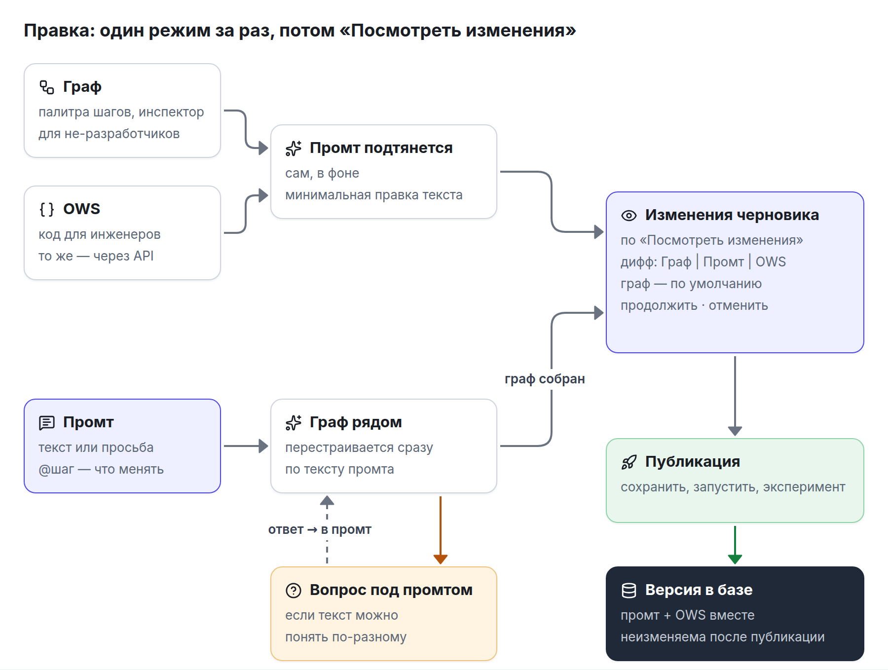

Как устроена правка:

1. **Один режим.** Над рабочей областью переключатель «Правка: Промт | Граф | OWS». Активен один режим. Переключиться можно в любой момент, черновик не теряется.
2. **Черновик сохраняется сам.** Каждая правка пишется в черновик в фоне, в шапке — «черновик сохранён · 14:02». У черновика нет кнопки «Сохранить»: версию сохраняют на шаге публикации.
3. **«Посмотреть изменения».** Кнопка в шапке сценария открывает экран изменений черновика. По умолчанию там дифф графа, переключатель «Граф | Промт | OWS» ведёт к диффу промта и диффу OWS.
4. **Решение.** С экрана изменений три пути: «Продолжить правку», «Отменить изменения» или «К публикации».

| Режим | Кто правит | Как | Что подтягивается само |
| --- | --- | --- | --- |
| Граф | Женя, Гоша | Палитра шагов слева, граф по центру, инспектор шага справа | Промт — минимальной правкой текста; OWS — тот же документ |
| OWS | Гоша, API-клиенты | Редактор с диагностикой или свой клиент через API | Промт — минимальной правкой текста; граф — раскладка того же документа |
| Промт | Женя | Текстом или просьбой «что поменять» с @шагом | Граф и OWS — сразу: граф стоит справа от промта и перестраивается по тексту |

Режим «Граф». Женя выбирает шаг «Спросить владельца» и ставит в инспекторе: ждать ответа 1 день, если ответа нет — напомнить в тикете, не больше 3 раз. Промт и OWS в это время закрыты, но уже подтянулись:

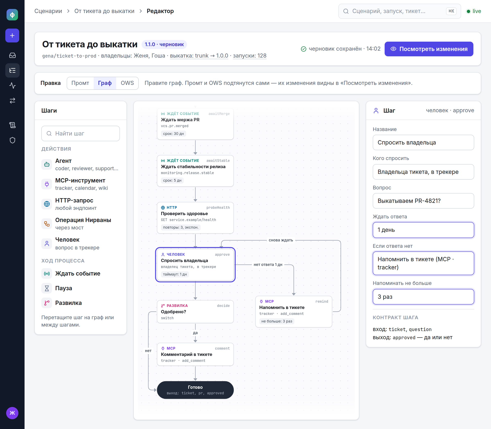

Женя нажимает «Посмотреть изменения». Слева — список: шаг «Спросить владельца» изменён, шаг «Напомнить в тикете» новый, две новые связи. Справа — дифф графа со слоем идущих запусков. Он открывается переходом от графа до правки к графу после неё, а кнопки «До правки | После правки» повторяют этот переход. На «Спросить владельца» сейчас ждёт 21 запуск, и после публикации Фабула спросит, переводить ли их.

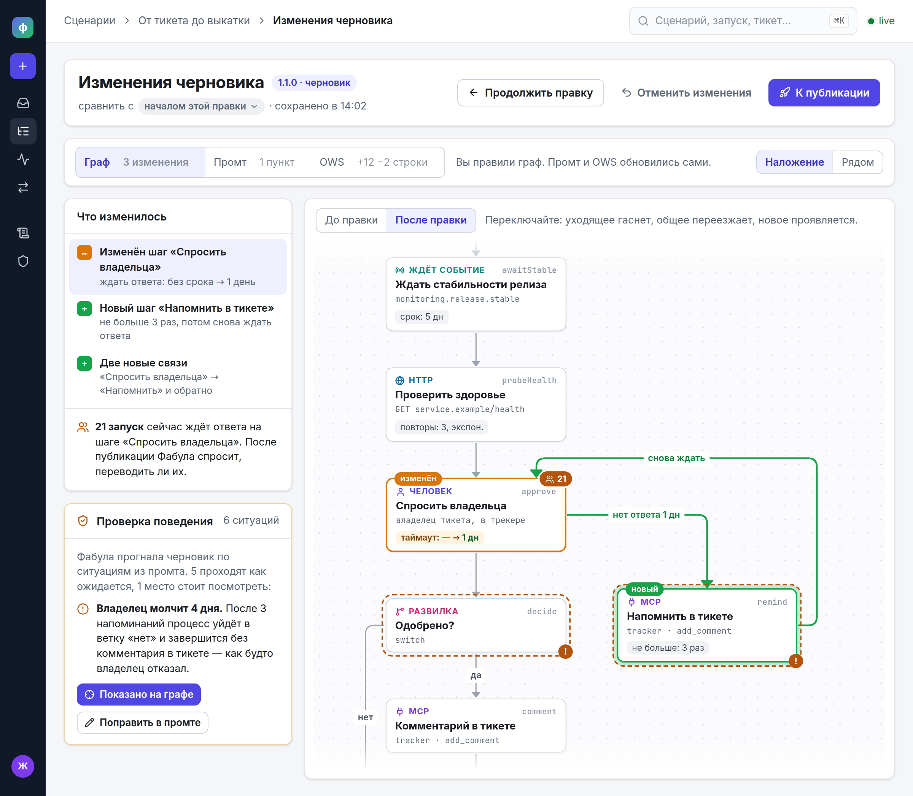

Под списком — карточка **«Проверка поведения»**. Фабула сама прогоняет черновик по ситуациям из промта: одобрено, отказ, владелец молчит, шаг не отвечает. Отдельной песочницы у пользователя нет: он видит только места, где процесс ведёт себя неожиданно. Здесь это «Владелец молчит 4 дня»: после 3 напоминаний процесс уйдёт в ветку «нет» и закончится без комментария в тикете. Шаги, где это случается, подсвечены на графе, а «Поправить в промте» ведёт в режим «Промт». Как устроена проверка, описано во вкладке «Как это устроить».

Переключатель показывает то же изменение в двух других видах. Во вкладке «Промт» — пункт 5, переписанный по правке графа. Остальной текст остаётся словами Жени. Формулировку можно поправить тут же, кнопкой «Поправить слова»:

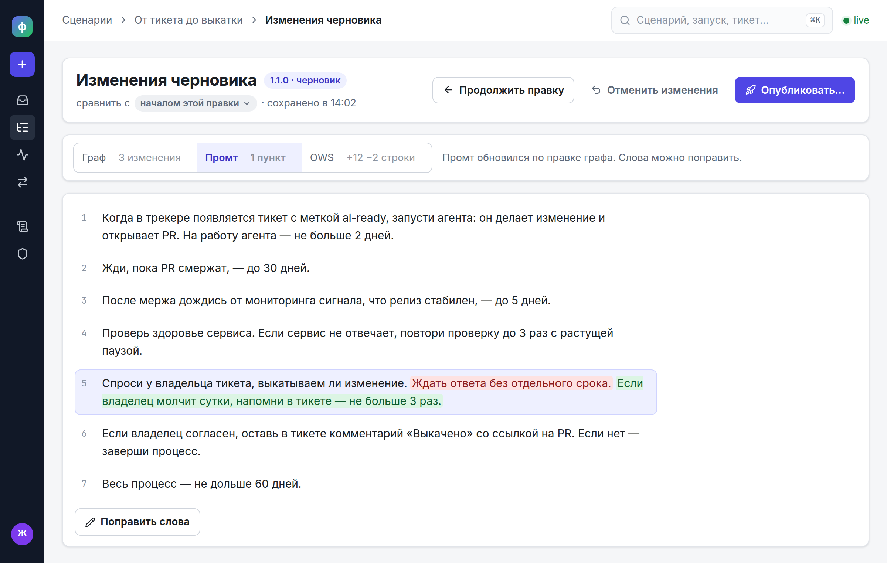

Во вкладке «OWS» — строки кода, которые получились из правки. Гоше на ревью не нужно гадать, во что превратился шаг на графе:

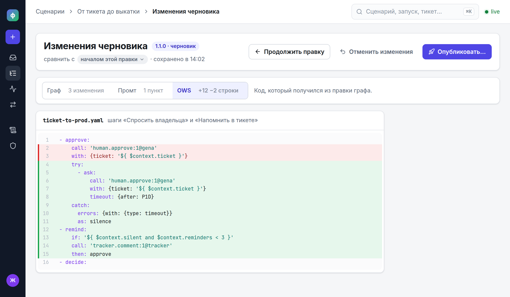

Пример с инженером. Гоша добавляет в OWS три повтора проверки здоровья при сбое связи. На экране изменений во вкладке «Промт» уже есть новый пункт: «если сервис не отвечает, повтори проверку до 3 раз с растущей паузой». Гоша меняет одно слово и отправляет версию на ревью Жене.

**Режим «OWS»** — для инженеров. Слева — код сценария: блоки вне правки свёрнуты, изменённые строки отмечены на полях. Справа — диагностика валидатора движка с позициями строк и контракт шага под курсором. Здесь Гоша ставит шагу approve срок ответа 1 день. Валидатор тут же предупреждает: `$silence` виден только внутри `catch`, и напоминание не сработает. Предупреждение исправляется одной кнопкой:

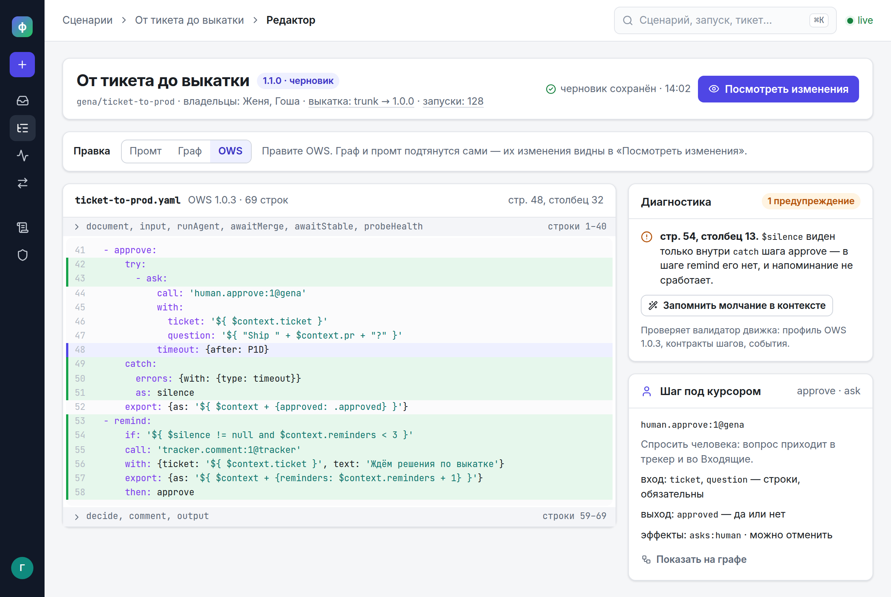

### Правка промта: текстом или просьбой

Правка промта меняет смысл, поэтому граф собирается заново — прямо в редакторе. Слева промт по пунктам, справа граф по этому тексту. Промт меняют двумя способами:

- **Текстом.** Переписывают пункт прямо в промте. Удалённое видно зачёркнутым, новое — подсвеченным.
- **Просьбой.** В поле «Или попросите словами» под промтом пишут, что поменять, и через @ указывают шаг: «@Спросить владельца если владелец молчит сутки — напомни в тикете, но не больше 3 раз». Ассистент отвечает коротким планом — какой пункт меняет и какие шаги затронет — и вносит правку в текст. Её можно дописать руками.

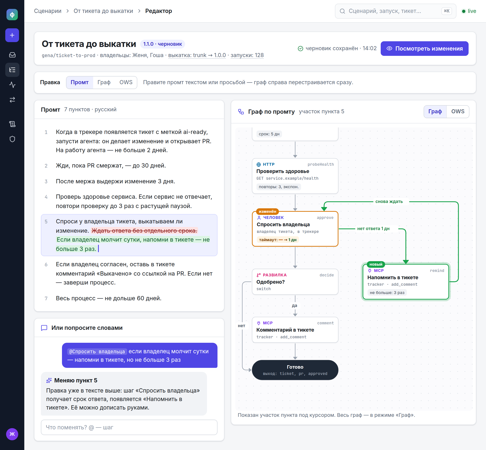

Граф рядом с промтом:

1. Перестраивается сразу, пока пишете, — переходом, как в дифф-вьюере. Показан участок пункта под курсором, весь граф — в режиме «Граф».
2. Если текст можно понять по-разному, вопрос появляется здесь же, под промтом (см. «Уточняющие вопросы»). Ответ дописывается в пункт.
3. «Посмотреть изменения» открывает тот же экран изменений: дифф графа, промта и OWS.

Промт пишется своими словами, по-русски по умолчанию. Фабула делит его на пункты и связывает каждый с шагами графа. В редакторе граф стоит рядом с промтом, а на экране изменений клик по изменению подсвечивает то же место в двух других видах. Ответы на уточняющие вопросы и принятые рекомендации попадают в промт явными пунктами — в разделы «Уточнения» и «Допущения».

Как Фабула следит, чтобы промт и граф описывали один процесс, пользователю не показывается. Это внутренняя механика, она описана во вкладке «Как это устроить».

### Какие бывают шаги

Отдельного каталога в меню нет. Шаги выбирают в палитре редактора, а подробности каждого видны в инспекторе.

| Шаг | Что делает | В ticket-to-prod |
| --- | --- | --- |
| Агент | Запускает ИИ-агента на задаче | «Агент делает PR»: агент coder |
| Человек | Задаёт вопрос в трекере и ждёт ответа | «Спросить владельца»: владелец тикета |
| MCP-инструмент | Вызывает инструмент подключённого MCP-сервера | «Комментарий в тикете» и «Напомнить в тикете»: tracker · add\_comment |
| HTTP-запрос | Вызывает любой эндпоинт | «Проверить здоровье»: GET service.example/health |
| Операция Нирваны | Запускает операцию во внутреннем исполнителе графов, через мост | — |
| Ждать событие, пауза, развилка | Ведут процесс: ждать сигнала, выдержать время, выбрать ветку | «Ждать мержа PR», «Выдержать изменение», «Одобрено?» |

В инспекторе у каждого шага — контракт: что шаг принимает и возвращает, можно ли его отменить, есть ли внешние эффекты. Версия шага закрепляется при публикации: новая версия агента или MCP-инструмента не меняет идущие запуски. Если нужного шага нет, Гоша подключает MCP-сервер или HTTP-эндпоинт. Внешние исполнители вроде Нирваны подключаются через мосты.

## Дифф-вьюер графа

Дифф-вьюер графа — сердце экрана «Посмотреть изменения» и главный способ показать любое изменение процесса. Человек видит на одном графе, что уходит, что появляется и что меняется, и не читает YAML. Один и тот же компонент работает везде:

- на экране изменений черновика;
- в версиях;
- в вариантах уточняющих вопросов;
- в миграциях запусков.

| Изменение | Как выглядит |
| --- | --- |
| Узел или ветка уходит | Красная пунктирная рамка, фейд, имя курсивом и зачёркнуто |
| Узел появляется | Зелёная рамка со свечением и метка «новый» |
| Меняются параметры | Янтарная рамка и чипы «было → стало», например `таймаут 2 д → 1 д` |
| Узел переименован | Новое имя, под ним серый призрак старого |
| Ребро уходит | Красный пунктир с фейдом |
| Ребро появляется | Зелёная сплошная линия с бегущей анимацией |
| Меняется только раскладка | Не подсвечивается |

Наложение 1.0.0 → 1.1.0. В нём три правки:

- напоминание владельцу — правка Жени;
- ожидание сигнала мониторинга вместо выдержки 3 дня;
- переименование проверки — правка Гоши.

Счётчики на узлах — идущие запуски. В «Было» видно, что 10 из них стоят на уходящем шаге «Выдержать изменение».

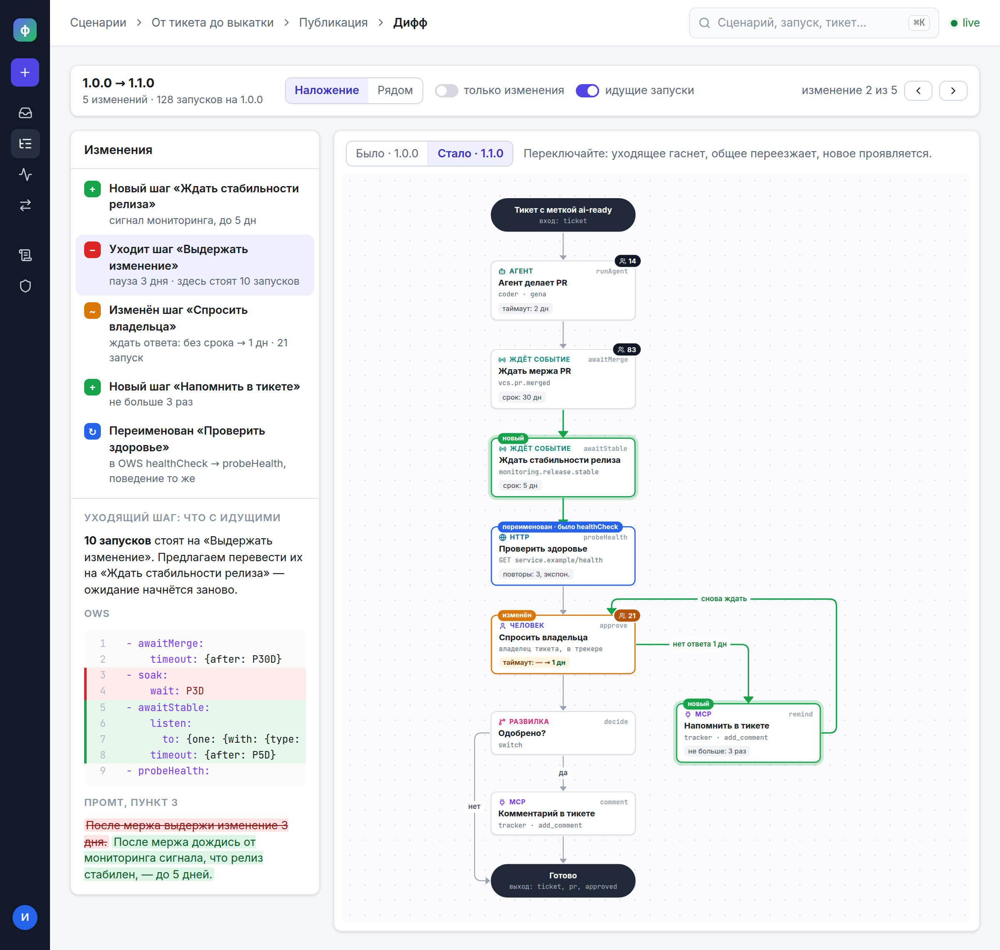

Режимы:

- **Наложение** (по умолчанию) — один граф с метками изменений и две кнопки: «Было · 1.0.0» и «Стало · 1.1.0». Дифф открывается переходом от «было» к «стало», кнопки повторяют его в любую сторону. Отдельного режима «Анимация» и ползунка нет:
  - уходящие шаги гаснут;
  - общие переезжают на новые места;
  - новые проявляются.
- **Рядом** — два графа с общим зумом и панорамой и линиями соответствия узлов.
- **Только изменения** — цепочки без изменений свёрнуты в плашку «… 4 узла без изменений».

Переход «Было → Стало → Было» идёт в три такта: уходящее гаснет, общее переезжает, новое проявляется. Так сравнивают снимки «до и после», только вместо ползунка — две кнопки.

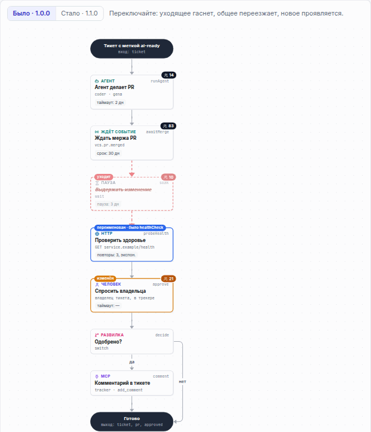

Режим «рядом» — две версии в одном масштабе:

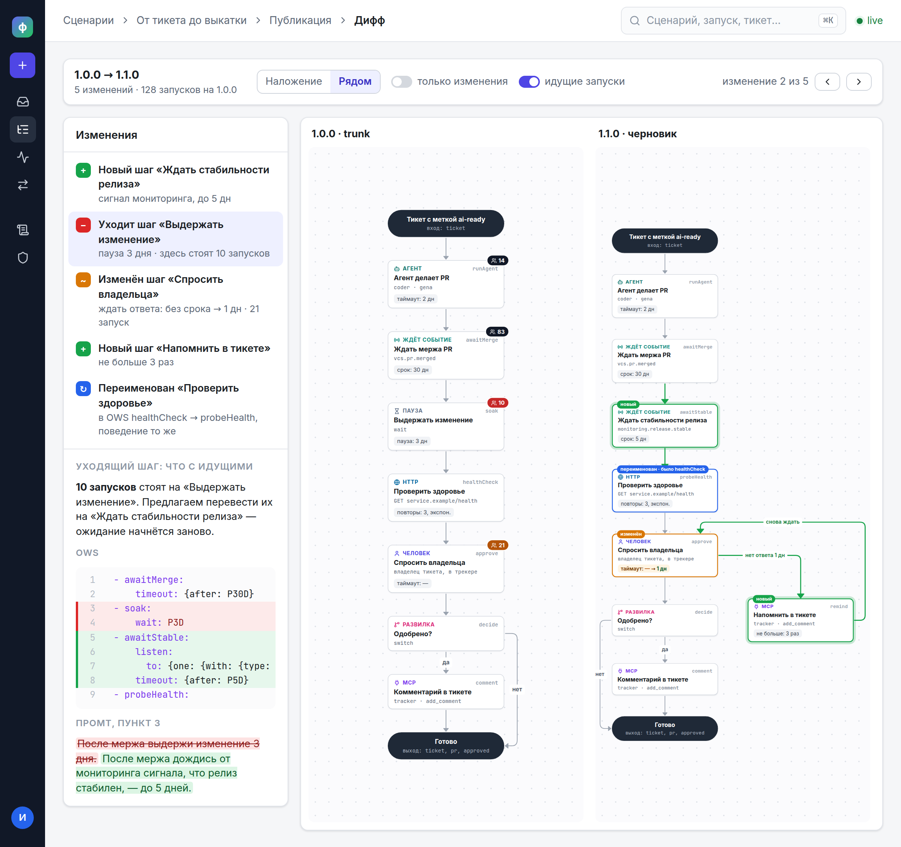

Режимы можно потрогать в [живом прототипе](https://claude.ai/artifact/SVRBtnXWaBovMjrSPKp2S2), экраны 5 и 6: дифф открывается переходом, а кнопки «Было / Стало» повторяют его.

Навигация:

- список изменений сбоку;
- «следующее / предыдущее» мышью или клавишами;
- клик по изменению центрирует граф и подсвечивает строки OWS и пункт промта.

Слой «идущие запуски»:

- на узлах старой версии — счётчики фабул, которые сейчас там стоят;
- рядом — вердикт перехода: на лету, с перезапуском узла, заблокирован.

Поэтому дифф сразу отвечает на вопрос релиз-менеджера: «что станет с теми, кто уже идёт». Данные даёт готовое API: `diffVersions` — узлы, поля, `static_compat` и подсказки маппинга; `countFabulas` и `createMigration` — счётчики и вердикты.

## Уточняющие вопросы

Фабула спрашивает, когда текст промта можно понять по-разному и от этого зависит граф. Вопрос появляется в редакторе, под промтом: отдельного шага «Уточнение» нет. Каждый вариант ответа — свой граф: при наведении на вариант граф справа перестраивается с анимацией. Переключатель «Граф | OWS» показывает тот же ответ как изменение кода сценария. Как Фабула находит такие места, описано во вкладке «Как это устроить».

Правила:

- **Не спрашиваем, если ответ можно найти самим** — в подключённых шагах или в прошлых ответах этого сценария.
- **1–4 вопроса за раз, в каждом 2–4 варианта.** Рекомендованный идёт первым с пометкой «рекомендуем».
- **У каждого варианта — короткое имя и строка о последствиях.**
- **Всегда есть свободный ввод.**
- **«Пропустить» принимает рекомендованный вариант** и записывает его в промт допущением. Допущение видно, к нему можно вернуться.
- **Наведение на вариант перестраивает граф с анимацией.** Узлы появляются и гаснут, рёбра перестраиваются — тем же языком, что и в дифф-вьюере. Смену параметров анимацией не показать, поэтому она видна чипами «было → стало» на узлах.

Пример. Женя пишет: «…спроси у владельца тикета, выкатываем ли…». Неясно одно — сколько ждать ответа:

| Вариант | Что меняется в графе |
| --- | --- |
| Без срока, до общего дедлайна 60 дней (рекомендуем) | Ничего не добавляется |
| 2 дня, потом напомнить в трекере и ждать снова | У шага «Спросить владельца» появляется срок ответа и цикл через шаг «Напомнить в тикете» |
| 2 дня, потом считать отказом | У шага «Спросить владельца» появляется срок ответа и ребро сразу в конец |
| Свой вариант | — |

Женя выбирает первый вариант. Ответ дописывается в пункт 5: «Ждать ответа без отдельного срока». Напоминание Женя добавит позже, в версии 1.1.0.

Так вопрос выглядит в редакторе нового сценария — «Собрать» открывает его сразу. Слева промт, разбитый на пункты; спорный пункт 5 подчёркнут, под промтом — вопрос. Курсор стоит на втором варианте, справа его граф против рекомендованного:

- у шага «Спросить владельца» появился срок ответа — это чип «было → стало»;
- шаг «Напомнить в тикете» — новый.

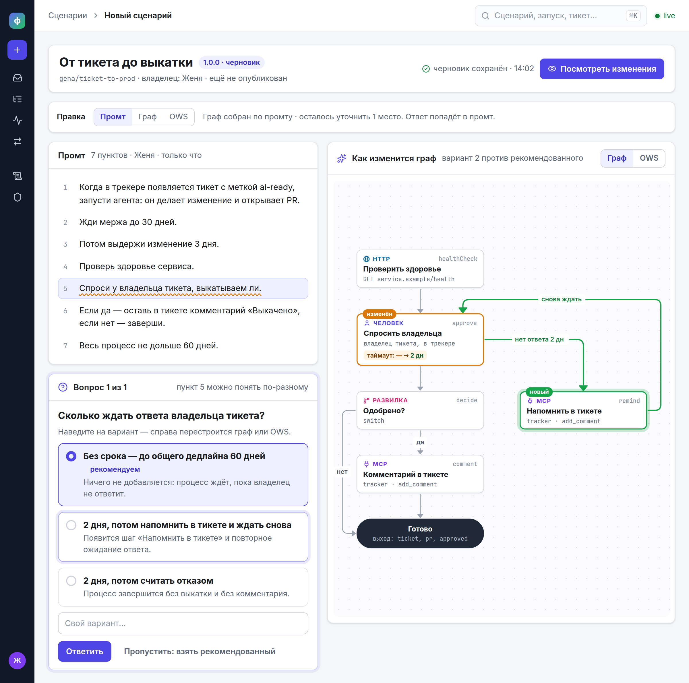

Перестройка графа при переходе между вариантами 1 → 2 → 3 → 1:

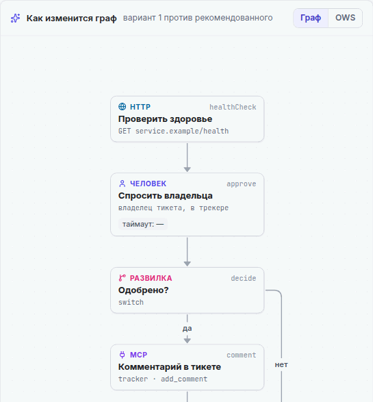

Тот же вопрос в виде «OWS». Красным выделены строки рекомендованного варианта, которые уходят, зелёным — строки, которые появятся с этим ответом:

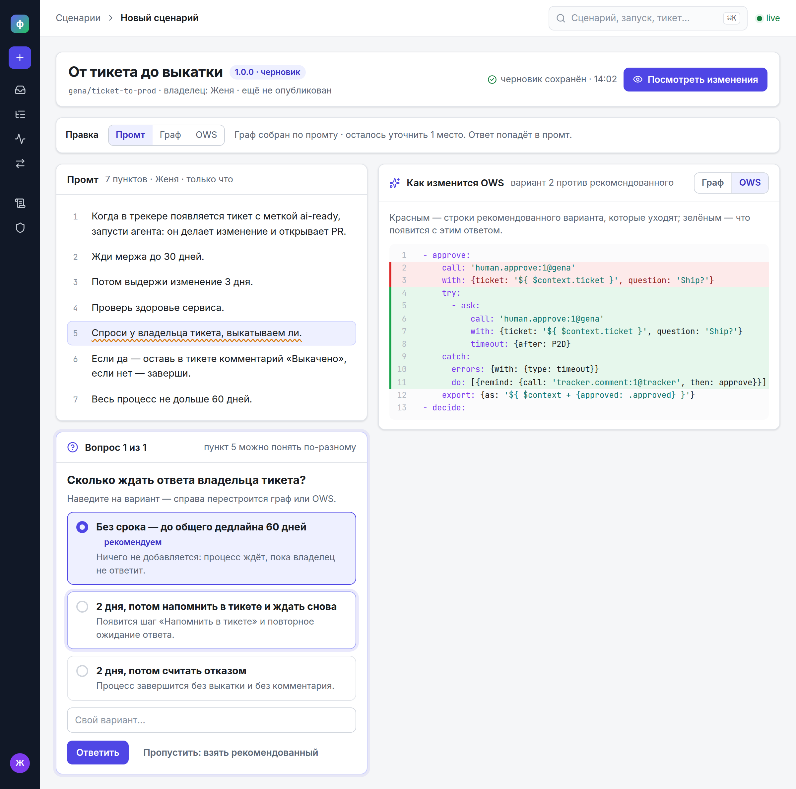

Вживую — [экран 2 прототипа](https://claude.ai/artifact/SVRBtnXWaBovMjrSPKp2S2): наведите курсор на варианты и ответьте — ответ ляжет в пункт 5, а граф встанет на выбранный вариант.

Бывают и вопросы о шагах. Если для действия нет подключённого агента, MCP-инструмента или HTTP-эндпоинта, Фабула предлагает на выбор:

- похожие подключённые шаги;
- заглушку, чтобы проверить процесс без настоящего шага;
- просьбу инженеру подключить новый.

## Словарь

Интерфейс говорит словами пользователя, а термины API остаются в подсказках для инженеров.

| В интерфейсе | Что это | В API |
| --- | --- | --- |
| Сценарий | Описание процесса: промт + OWS, с историей версий | `scenario` |
| Версия | Неизменяемый снимок сценария: промт, OWS и закреплённые версии шагов | `version` |
| Черновик | Будущая версия, пока её правят. Сохраняется сама после каждой правки, с ревизиями | новое: `draft` |
| Запуск | Идущий экземпляр сценария; в текстах для инженеров — фабула | `fabula` |
| Метка | Ключ другой системы на запуске: тикет, PR, заказ. Своих колонок у таких сущностей нет, по меткам ищут запуски | labels |
| Шаг | Узел графа: действие, ожидание события, пауза или развилка | `task` |
| Шаг-действие | Шаг, который что-то вызывает: агент, человек, MCP-инструмент, HTTP-запрос или операция внешней системы, например Нирваны через мост | `capability` |
| Событие | Внешнее событие: сценарий его ждёт или публикует | `event type` |
| Проверка поведения | Прогон черновика по ситуациям из промта под капотом. Пользователь видит только проблемные места на экране изменений | новое; прогон — на sandbox |
| Тег | Имя, по которому стартуют новые запуски, например trunk. Может делить старты между версиями — это эксперимент | `tag` |
| Эксперимент | Часть новых стартов тега идёт на новую версию, не больше 50 %; метрики сравниваются по плечам A/B. Больше половины — уже перевод тега | деление тега между версиями |
| Миграция | Перевод идущих запусков на другую версию | `migration` |
| Вмешательство | Ручное действие над запуском: пауза, повтор шага, пропуск и другие | `control` |
| Ассистент | ИИ-помощник: меняет промт по просьбе словами, объясняет, почему запуск ждёт | новое |
| Агент-резолвер | Агент, который разбирает конфликты миграции по политике сценария | `resolution task`, `agent_proposes`, `agent_applies` |

## Персоны

У Фабулы четыре персоны и один нечеловеческий актор. Роли в таблице — те, что уже есть в сервере.

| Персона | Роль | Задачи | Что важно | Главные экраны |
| --- | --- | --- | --- | --- |
| **Женя**, владелец процесса | `author` | Описывает и меняет процесс, отвечает на вопросы, смотрит изменения и проблемные места, запускает эксперимент | Система поняла правильно. Нет очереди к разработчикам. Ничего не сломать | «+ Новый сценарий», страница сценария |
| **Гоша**, инженер | `author` | Правит OWS, подключает MCP-серверы и HTTP-эндпоинты, ревьюит изменения | Точный дифф. Контракты шагов. Промт не врёт о коде | Редактор: OWS и «Посмотреть изменения» |
| **Ольга**, оператор поддержки | `operator` | Находит застрявший запуск, понимает причину, вмешивается | Быстро найти. Причина простыми словами. Безопасные действия | Запуски, карточка запуска |
| **Игорь**, релиз-менеджер | `operator` | Выкатывает версии, ведёт эксперименты и миграции, настраивает правила агента, откатывает | Прогноз до действия. Контроль риска. Откат за минуту | Выкатка, Миграции, Входящие |
| **Агент-резолвер** | `resolver` | Берёт задачи по группам запусков в миграции, предлагает перевод на другой шаг и правку контекста | Работает в рамках политики, каждое действие видно людям | Только API; люди видят его работу во Входящих |

## CJM

Сценарий проходит путь от идеи до миграции идущих запусков, и на каждом этапе есть свой хозяин:

- Женя — создаёт и меняет;
- Гоша — уточняет и ревьюит;
- Ольга — следит за идущими запусками;
- Игорь — выкатывает и переводит.

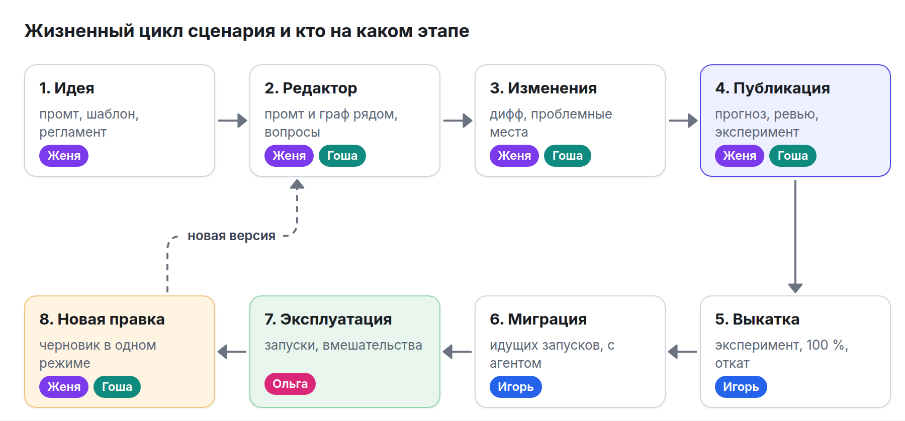

В таблицах ниже строка — этап пути персоны.

### Женя: от идеи до выкатки

| Этап | Что делает и где | Ощущения | Боль без Фабулы | Что даёт Фабула |
| --- | --- | --- | --- | --- |
| Идея | «+ Новый сценарий»: пишет, как идёт процесс, прикладывает регламент | Надежда и сомнение | ТЗ и недели ожидания разработки | Процесс начинается с текста своими словами; шаблоны и примеры |
| Сборка | Редактор нового сценария: промт слева, граф справа; вопрос под промтом, наводит на варианты | Интерес | Непонятно, как система поняла текст | Вопросы только о спорном; каждый вариант виден на графе |
| Просмотр | Редактор, режим «Граф»: щёлкает по шагам, в инспекторе видит параметры и контракт шага | Уверенность растёт | YAML нечитаем | Граф с подписями человеческим языком; у каждого шага видно, что он вызывает: агента, человека, MCP или HTTP |
| Изменения | «Посмотреть изменения»: дифф и карточка «Проверка поведения» — Фабула сама прогнала «одобрено», «отказ», «владелец молчит» и подсветила проблемные места | Спокойствие | Проверить можно только в проде | Проверка поведения под капотом: проблемные места видны на графе до публикации |
| Публикация | «К публикации»: просит ревью у Гоши, «Сохранить и запустить» — 1.0.0 получает новые старты | Волнение | Страх сломать боевой процесс | Экран изменений перед публикацией, ревью и выкатка на часть новых стартов |
| Изменение | Редактор: добавляет напоминание на графе или просьбой в промте, затем «Посмотреть изменения» — дифф графа, промта и OWS | Контроль | Любое изменение — снова разработка | Правка за минуты; Игорь сразу получает вопрос об идущих запусках |

Метрики пути:

- время от первого промта до публикации;
- число вопросов на сценарий;
- доля правок без инженера.

### Гоша: ревью и точные правки

| Этап | Что делает и где | Ощущения | Боль без Фабулы | Что даёт Фабула |
| --- | --- | --- | --- | --- |
| Запрос | Входящие: ревью версии 1.1.0 от Жени | Рутина | Изменения приходят устно и без контекста | Ревью с диффом графа, OWS и промта в одном месте |
| Разбор | «Публикация»: дифф-вьюер и прогноз совместимости | Ясность | YAML приходится читать построчно | Изменения на графе и счётчики идущих запусков |
| Правка | Редактор в режиме «OWS» с диагностикой или свой API-клиент | Поток | Правка в одном месте ломает другое | Диагностика с позициями (`validateScenario`); все правки — через API в один черновик |
| Изменения | «Посмотреть изменения»: дифф графа, промта и OWS; во вкладке «Промт» уже есть пункт о повторах проверки | Облегчение | Документация отстаёт от кода | Промт обновляется сам, изменение видно на ревью |
| Промт | «Поправить слова»: меняет одно слово в пункте, который обновился сам | Уверенность | Нечем проверить, что текст и код совпадают | Текст остаётся точным описанием кода, а не пересказом |
| Шаги | Инспектор шага: подключает MCP-инструмент или HTTP-эндпоинт, закрепляет версию | Контроль | Неясно, кого заденет смена контракта | Контракт шага в инспекторе и закреплённые версии |

Метрики пути:

- доля версий, где промт не пришлось править руками;
- время ревью;
- доля версий, вернувшихся с ревью.

### Ольга: застрявший запуск

| Этап | Что делает и где | Ощущения | Боль без Фабулы | Что даёт Фабула |
| --- | --- | --- | --- | --- |
| Сигнал | Входящие или сообщение: «тикет QUEUE-4821 висит неделю» | Тревога | Непонятно, где искать | Поиск по бизнес-ключу, сохранённый вид «Застряли» |
| Поиск | Запуски: вводит QUEUE-4821, видит запуск на шаге `awaitMerge` | Облегчение | Журналы в разных системах | Один список с позицией на графе |
| Диагностика | Карточка: «ждёт `vcs.pr.merged` для PR-4821, дедлайн через 23 дня», кнопка «Объясни» | Понимание | Журнал из сотен строк | Причина простыми словами и связь с пунктом промта |
| Действие | Вмешательство «завершить ожидание» с причиной; Фабула предупреждает о побочных эффектах | Осторожность | Страх сделать хуже | Превью последствий, предупреждения для необратимых шагов |
| Контроль | Исход вмешательства и аудит; похожие случаи — массово по фильтру | Уверенность | Не видно, помогло ли | Исход в карточке и запись в аудите |

Метрики пути:

- время до разблокировки застрявшего запуска;
- доля вмешательств без повторного обращения.

### Игорь: выкатка и миграция

| Этап | Что делает и где | Ощущения | Боль без Фабулы | Что даёт Фабула |
| --- | --- | --- | --- | --- |
| Новая версия | Входящие: опубликована 1.1.0 | Настороженность | О релизе узнают постфактум | Уведомление с диффом и прогнозом |
| Прогноз | «Публикация»: из 128 идущих 97 перейдут на лету, 21 — с перезапуском шага, 10 заблокированы | Ясность | Неизвестно, что будет с идущими | Прогноз по каждому запуску до решения |
| Выкатка | «Выкатка»: эксперимент — 1.1.0 на 10 % новых стартов, метрики по плечам | Контроль | Всё или ничего | A/B по тегу, продвижение шагами, пауза |
| Перевод тега | «Запустить на 100 %»: `trunk` → 1.1.0; открывается миграция запусков, никто не переезжает сам | Спокойствие | Перевод тега двигает всех сразу | Миграция-вопрос вместо автоматического переезда |
| Миграция | Доска вердиктов: группы запусков, решения, делегирование агенту миграций: он предлагает, человек одобряет | Сосредоточенность | Каждый запуск разбирать вручную | Группы по причине, одно решение на группу |
| Предложения агента | Входящие: предложение агента с обоснованием и пробным переводом | Доверие с проверкой | Агенту либо всё, либо ничего | Правила с ограничениями, пробный перевод и одобрение |
| Применение и откат | Ввод имени миграции, ход применения; при проблеме — откат тега и откат миграции | Уверенность | Откат — ручная операция | Откат тега за минуту и откат миграции |

Метрики пути:

- время отката;
- доля миграций без инцидентов;
- доля решений, делегированных агенту.

## Карта интерфейса

Меню отвечает на вопросы персон. Сверху — кнопка «+ Новый сценарий», под ней четыре рабочих пункта:

- «+ Новый сценарий» — что создать;
- «Входящие» — что ждёт меня;
- «Сценарии» — какие есть сценарии;
- «Запуски» — что идёт;
- «Миграции» — что переводим.

И два служебных — аудит и доступ. У сценария одна страница, без вкладок: редактор, из него «Посмотреть изменения», оттуда публикация и выкатка.

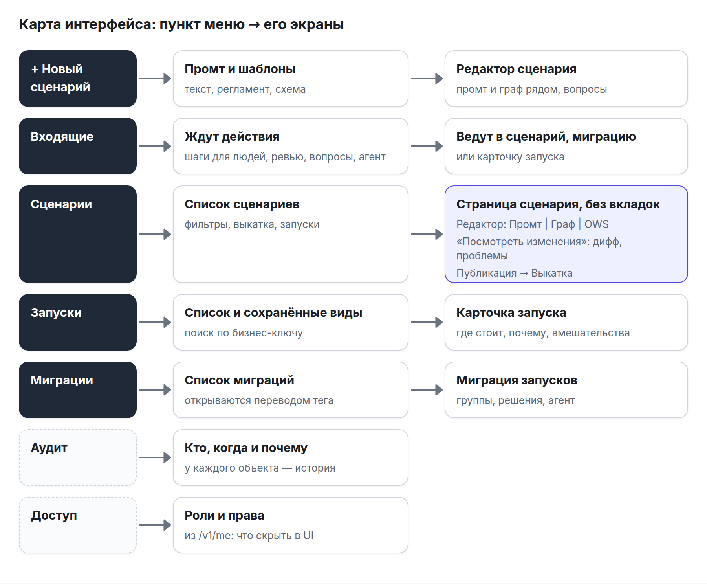

Переходы между разделами:

- из Входящих — к объекту, который ждёт решения;
- из списка сценариев — в редактор, к выкатке и к запускам сценария;
- с публикации и выкатки — к миграции: её открывают «Сохранить и запустить» и «Запустить на 100 %»;
- из любого списка — в карточку запуска.

Все 13 экранов из этого дока собраны в [живом прототипе](https://claude.ai/artifact/SVRBtnXWaBovMjrSPKp2S2) на Vite + React + React Flow — это стек будущей веб-морды.

## Разделы интерфейса

По каждому разделу — зачем он, что в нём можно сделать и какие операции API за этим стоят.

- «есть» — операция уже есть в сервере;
- «новое» — она понадобится для prompt-first или для этого экрана.

### Новый сценарий

Кнопка «+ Новый сценарий» стоит в меню над остальными пунктами и дублируется в списке сценариев. Она открывает поле промта: создание сценария — главное действие продукта. Рядом — только шаблоны частых процессов. «Собрать» сразу открывает редактор нового сценария: промт слева, граф справа, уточняющий вопрос — под промтом. Отдельного шага «Уточнение» нет.

| Функция | Кому | API |
| --- | --- | --- |
| Промт своими словами, режим «сначала план» | Женя | новое: генерации |
| Регламент или схема вложением (PDF, картинка) | Женя | новое: генерации |
| Шаблоны частых процессов | Женя | новое: опубликованные сценарии с меткой «шаблон» |
| Уточняющие вопросы — в редакторе, под промтом (см. выше) | Женя | новое: генерации и ответы |
| Создание сценария из принятого графа | Женя | есть: `createScenario`, `validateScenario` |

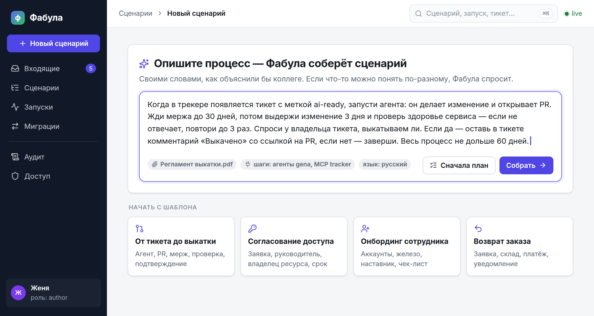

### Входящие

«Ждут действия» — одна очередь всего, где нужен человек. В ней два вида записей:

- шаги процессов, которые спрашивают людей, например «Спросить владельца»: ответить можно здесь или в канале шага, например в трекере;
- задачи самой Фабулы: ревью, вопросы по сценарию, решения по миграции, предложения агента, падающий шаг, зависший запуск.

Запуски, которые ждут событие или таймер, сюда не попадают — они в «Запусках». Из каждой записи действие доступно сразу, без перехода в другой раздел. Ответственный всегда человек, даже когда работу делает агент. Записи написаны названиями шагов, а не их id.

| Функция | Кому | API |
| --- | --- | --- |
| Быстрые фильтры: «Ждут меня», «Все» и фильтры по названиям шагов, которые спрашивают людей, — собираются сами по всем сценариям | все | новое: фильтр по шагу и адресату |
| Шаги процессов для людей: ответ прямо здесь или в канале шага | все | новое: задачи шагов «человек» |
| Предложения агента: принять, править, ответить, отклонить | Игорь | есть: `listResolutionTasks`, `getResolutionTask`, `dryRunResolution`, `approveResolution`, `rejectResolution` |
| «Принимать такие без меня» — переход на `agent_applies` | Игорь | есть: `setResolutionPolicy` |
| Решения по миграции: одно на группу запусков | Игорь | есть: `listMigrationClusters`, `decideMigration` |
| Ревью версии | Гоша | новое: запросы ревью |
| Вопросы по сценариям и падающие шаги | Женя, Гоша | новое: вопросы генерации, правило «шаг падает» |
| Застрявшие запуски | Ольга | есть: `searchFabulas`; новое: правила «застрял» |
| Счётчик в меню, живые обновления | все | есть: `streamNotifications` |

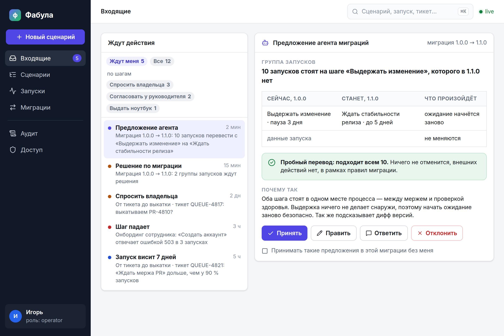

### Сценарии

Список сценариев — вход в правку: клик по строке открывает редактор сценария. У каждой строки — черновик, выкатка, идущие запуски и состояние. Бейдж выкатки ведёт на её экран, число запусков — в «Запуски» с фильтром по сценарию. Кнопка «+ Новый сценарий» здесь дублирует кнопку в меню.

| Функция | Кому | API |
| --- | --- | --- |
| Список: владельцы, метки, теги, версии, идущие запуски | все | есть: `listScenarios`, `listTags`, `countFabulas` |
| Быстрый фильтр «Мои»: где я владелец или автор черновика; состояние: черновик, работает, есть упавшие | все | есть: listScenarios, countFabulas |
| Черновик: кто и когда правил | все | новое: черновики с ревизиями |
| Карточка: владельцы, ссылки на требования | Женя, Гоша | есть: `getScenario`, `updateScenario` |

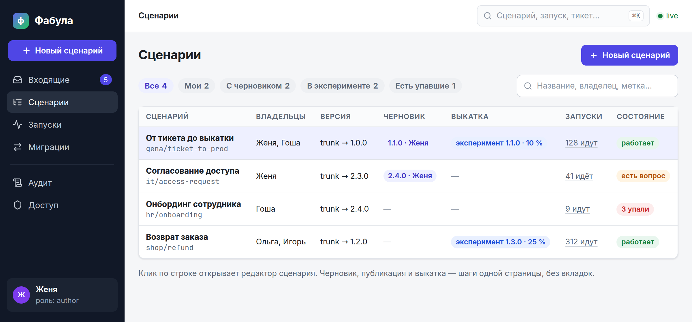

### Страница сценария

У сценария одна страница, без вкладок. Работа идёт шагами одного флоу: редактор → «Посмотреть изменения» → публикация → выкатка. В шапке — ссылки на выкатку и на запуски сценария; запуски открываются в разделе «Запуски» с фильтром.

| Шаг | Функции | Кому | API |
| --- | --- | --- | --- |
| Редактор | Режимы «Промт», «Граф» и «OWS», активен один; в режиме «Промт» граф рядом и перестраивается сразу, уточняющие вопросы — под промтом; палитра шагов и инспектор шага; правка промта текстом или просьбой с @шагом; диагностика OWS с позициями; черновик сохраняется сам | Женя, Гоша | есть: `getVersion`, `validateScenario`, `listCapabilities`, `listEventTypes`; новое: черновики с ревизиями, промт в версии, подключение MCP и HTTP |
| Изменения (из редактора) | «Посмотреть изменения»: дифф графа по умолчанию, переключатель на дифф промта и OWS; карточка «Проверка поведения» с проблемными местами на графе; «Продолжить правку», «Отменить изменения», «К публикации» | Женя, Гоша | есть: `diffVersions`; для проверки поведения — `startFabula`, `completeSandboxInvocation`, `publishSandboxEvent`, `advanceSandboxClock`, `getSandbox`, `listSandboxInvocations`, `listSandboxEvents`, `settleSandbox`; новое: дифф черновика, обновление промта по правке, проверка поведения |
| Публикация (из изменений) | История; дифф-вьюер; прогноз по идущим запускам; гейт публикации; «Сохранить и запустить», «Запустить эксперимент» на часть новых стартов, до 50 %, и «Сохранить» — только версия; устаревание версии | Гоша, Игорь | есть: `listVersions`, `diffVersions`, `publishVersion`, `moveTag`, `allocateTag`, `deprecateVersion` |
| Выкатка (после публикации и из списка) | Теги и A/B-плечи, метрики плеч, продвижение («До 25 %», «Запустить на 100 %») и откат, «какую версию получит ключ», история тега | Игорь | есть: `getTag`, `allocateTag`, `moveTag`, `rollbackTag`, `getTagHistory`, `resolveTag`; новое: метрики плеч |
| Настройки (меню в шапке) | Владельцы, ссылки на требования, политика разрешения конфликтов | Гоша, Игорь | есть: `updateScenario`, `setResolutionPolicy` |

Макеты редактора и экрана изменений — выше, в разделе [«Правка: один режим и «Посмотреть изменения»»](#правка-один-режим-и-посмотреть-изменения).

**Публикация.** «К публикации» на экране изменений открывает этот шаг. Сначала прогноз по идущим запускам, потом дифф, справа гейт публикации: диагностика OWS, подключённые шаги, проверка поведения и ревью. Кнопки открыты, только когда все пункты зелёные:

- «Сохранить и запустить» — главная: версия сохраняется, все новые старты идут на неё, открывается миграция идущих запусков;
- «Запустить эксперимент» — версия сохраняется и получает часть новых стартов, дальше — шаг «Выкатка»;
- «Сохранить» — только версия, тег остаётся на прежней; запустить её можно позже с выкатки.

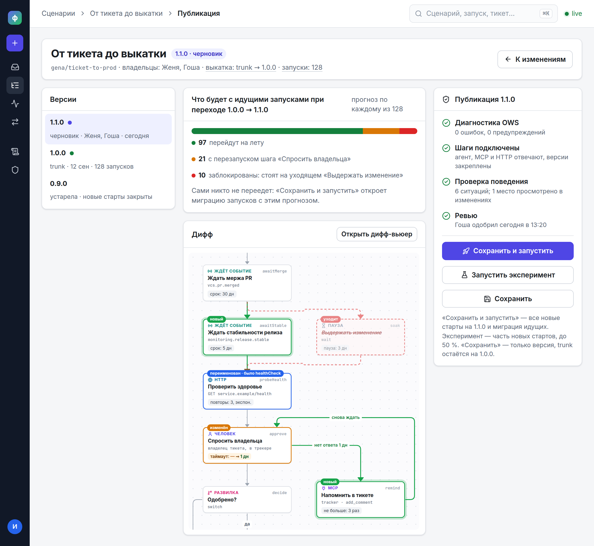

«Запустить эксперимент» открывает диалог: доля новых стартов — ползунком или числом, не больше 50 %, и кнопка «Запустить». Больше половины — это уже не эксперимент, а запуск на 100 %. Регрессия ставит эксперимент на паузу сама:

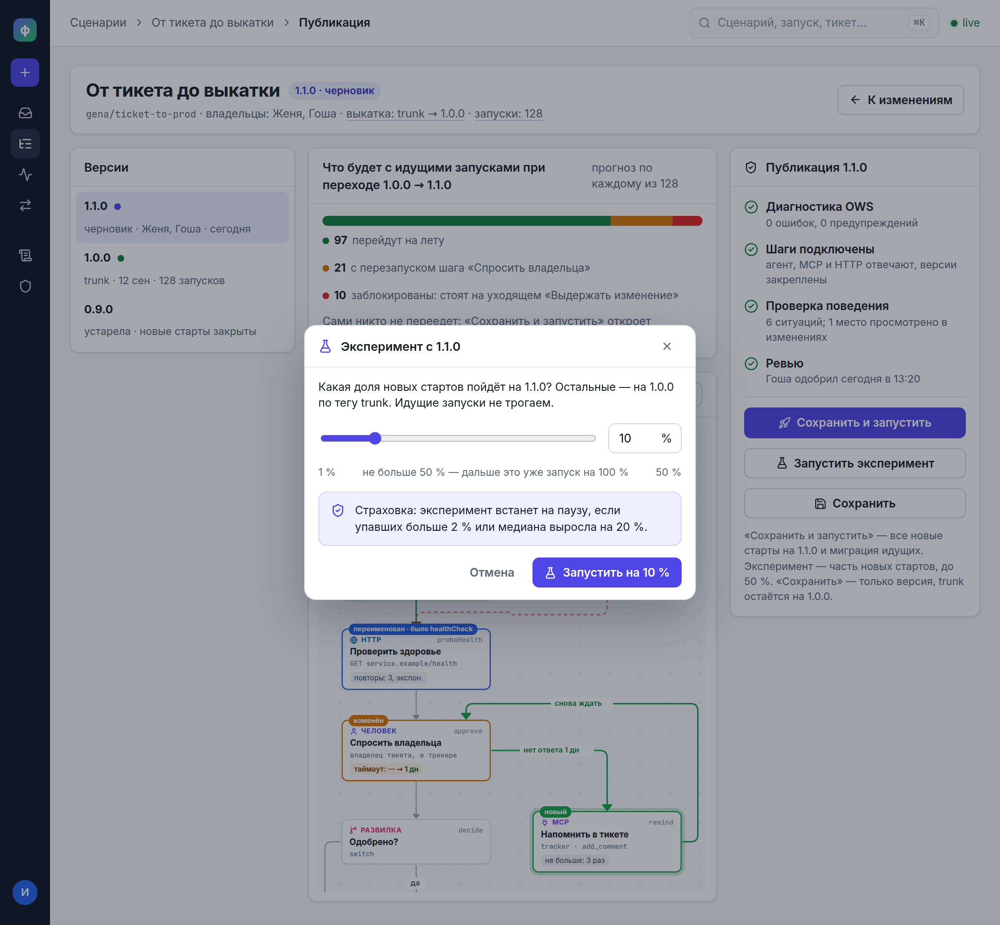

**Выкатка.** Новые старты `trunk` делятся 90 / 10 между версиями, метрики сравниваются по плечам. «До 25 %» расширяет эксперимент, «Запустить на 100 %» отдаёт новой версии все новые старты и открывает миграцию идущих. Откат и «вернуть» в истории — одно действие.

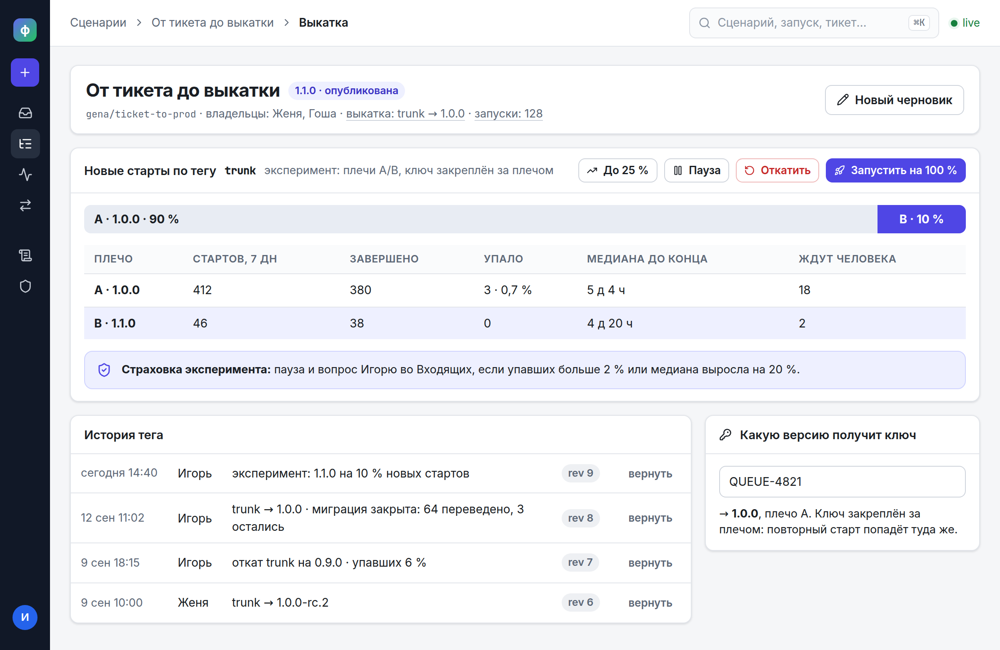

### Запуски

Раздел отвечает на два вопроса: где сейчас конкретный запуск и что с ним сделать. Ищут по бизнес-ключу — тикету или заказу, а не по id фабулы.

| Функция | Кому | API |
| --- | --- | --- |
| Сохранённые виды со счётчиками: «Застряли», «Ждут человека», «В эксперименте» | Ольга | есть: `searchFabulas`, `countFabulas`; новое: сохранённые виды |
| Поиск по меткам — бизнес-ключам других систем: тикет, PR, заказ. Своих колонок у этих сущностей нет, в списке они видны в колонке «Метки» | Ольга | есть: `searchFabulas` по меткам |
| Карточка: позиция на графе, журнал, контекст, вызовы и таймеры | Ольга | есть: `getFabula`, `getFabulaJournal` |
| «Почему ждёт» и «Объяснить» со ссылкой на пункт промта | Ольга | новое: `explain` |
| Вмешательства с причиной и превью, исход вмешательства | Ольга | есть: `controlFabula`, `getControlOutcome` |
| Массовые вмешательства по фильтру с ходом и отменой | Ольга | новое |
| Импорт запуска и починка индекса | Гоша | есть: `importFabula`, `reconcileFabula`, `reconcileFabulas` |

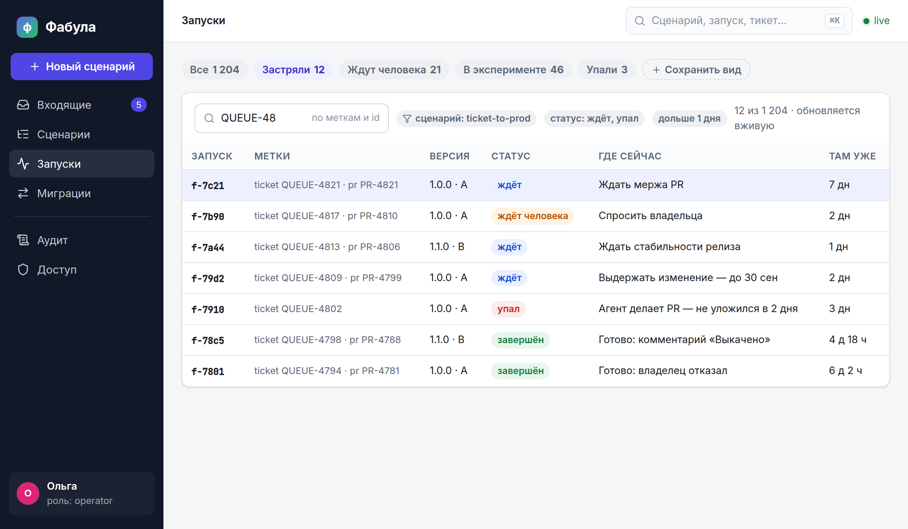

Карточка запуска QUEUE-4821 из пути Ольги:

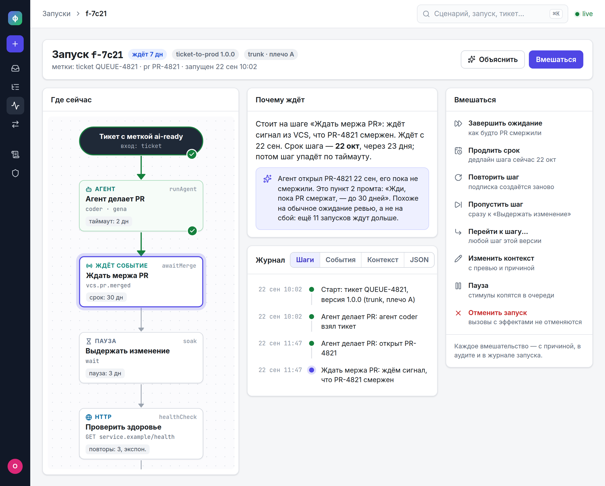

### Миграции

Миграция запусков решает, что делать с идущими запусками при смене версии. Она открывается сама, когда тег переводят на новую версию. Запуски сгруппированы по причине, решение принимается на группу, никто не переезжает без решения. В API это «кампания миграции», в интерфейсе — просто миграция.

| Функция | Кому | API |
| --- | --- | --- |
| Список миграций | Игорь | есть: `listMigrations` |
| Доска вердиктов и группы по причине | Игорь | есть: `getMigration`, `listMigrationItems`, `listMigrationClusters` |
| Решение на группу: перевести, перевести на другой шаг, оставить, отдать агенту, отменить | Игорь | есть: `decideMigration` |
| «Откуда → куда» в дифф-вьюере, с подсказками, на какой шаг переводить | Игорь | есть: `diffVersions` |
| Применение с подтверждением именем, пауза, продолжение, отмена | Игорь | есть: `applyMigration`, `pauseMigration`, `resumeMigration`, `cancelMigration` |
| Повторный анализ и откат переведённых | Игорь | есть: `refreshMigration`, `revertMigration` |
| Задачи агента: аренда, предложение, возврат | агент-резолвер | есть: `leaseResolutionTasks`, `submitResolution`, `releaseResolutionTask` |

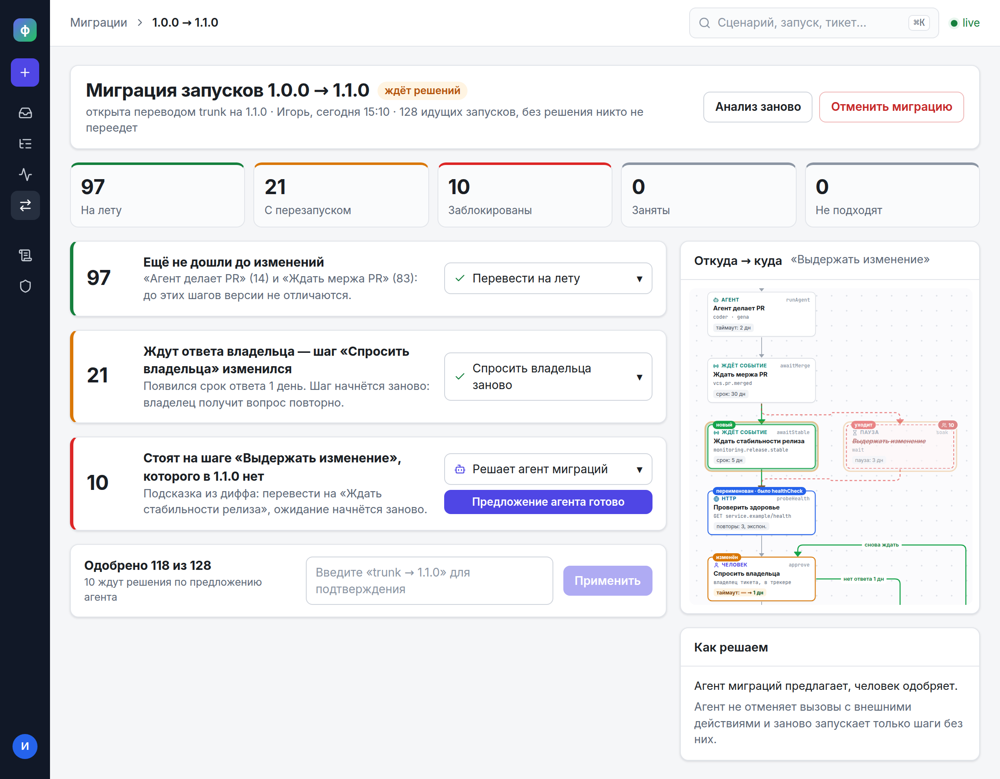

### Аудит и доступ

Служебные разделы: сами по себе редко нужны, но на них опираются остальные экраны.

| Раздел | Функции | API |
| --- | --- | --- |
| Аудит | Кто, когда и почему; история у каждого объекта | есть: `listAudit` |
| Доступ | Роли и права текущего актора; позже — выдача ролей | есть: `getMe` |

## Сквозные механики

Эти механики работают одинаково во всех разделах. Их делаем один раз — в оболочке приложения.

| Механика | Как работает | API |
| --- | --- | --- |
| Живые обновления | Один поток на вкладку. Экраны подписываются на свои ресурсы. По `reset` экран перечитывает данные | есть: `streamNotifications` |
| Права в интерфейсе | Недоступные действия скрыты. Если нужно объяснение — показаны с подсказкой «нужна роль operator» | есть: `getMe` |
| Подтверждения | Необратимое спрашивает причину и показывает последствия: шаги `cancellable: false`, эффекты `external`, отмена запуска. Массовые действия и применение миграции — вводом имени | есть: дескрипторы шагов в `listCapabilities` |
| Идемпотентность | Каждая кнопка создаёт `request_id`, повторное нажатие безопасно. Конфликт ревизий показывает «кто-то уже изменил» и дифф | есть: `request_id`, `expected_revision` |
| Правки только через API | Веб-редактор и любые API-клиенты пишут в один черновик с ревизиями. После каждой правки промт подтягивается сам | новое: черновики с ревизиями |
| Одна правка за раз | В редакторе активен один режим — промт, граф или OWS. Черновик сохраняется сам, правку завершает «Посмотреть изменения» | новое: дифф черновика |
| Командная палитра ⌘K | Переход к сценарию, запуску по метке или миграции; действия словами («останови эксперимент») | есть: поиски; новое: разбор команд |
| След в аудите | У каждого объекта есть история: кто, когда, почему | есть: `listAudit` |
| Ссылки на всё | Любой экран, фильтр или изменение в диффе открывается по URL | — |

## Метрики продукта

Главная метрика — время от первого промта до первой опубликованной версии. Остальные показывают, что скорость не покупается качеством и безопасностью. Ориентиры — предложение для первого полугодия.

| Метрика | Что меряем | Ориентир |
| --- | --- | --- |
| От промта до публикации | Медиана времени от первого промта до первой опубликованной версии | Меньше дня |
| Промт без ручной правки | Доля правок графа и OWS, после которых промт не пришлось поправлять руками | ≥ 80 % |
| Вопросы на сценарий | Среднее число уточняющих вопросов до первой публикации | 1–3, и снижается со временем |
| Правки без инженера | Доля версий, собранных промтом или в визуальном редакторе, без правок OWS | ≥ 50 % |
| Застрявшие запуски | Медиана времени от сигнала до разблокировки | Меньше часа |
| Миграции без инцидентов | Доля миграций без отката и без упавших после перевода запусков | ≥ 95 % |
| Откат | Время от решения откатить до новых стартов на старой версии | Меньше минуты |
| Доверие к агенту | Доля предложений агента, принятых без правок | Следим по сценариям; рост — повод перейти на `agent_applies` |

## Этапы

Первый этап строится целиком на уже готовом API сервера. Prompt-first требует нового сервиса генерации и идёт вторым.

1. **Этап 1. Веб-морда на готовом API.**
   - Запуски и карточка запуска с вмешательствами.
   - Входящие: решения по миграциям и предложения агента.
   - Миграции и выкатка с откатом.
   - Версии и дифф-вьюер графа.
   - Проверка поведения и аудит; палитра шагов из `listCapabilities`.
   - OWS-редактор с `validateScenario` и граф для чтения.

   **Готово, когда:** Игорь проводит миграцию, а Ольга разбирает застрявший запуск — оба без curl.
2. **Этап 2. Prompt-first.**
   - Промт хранится в версии.
   - Генерация с уточняющими вопросами.
   - Автообновление промта и экран «Посмотреть изменения».
   - Визуальный редактор графа.
   - Черновики с ревизиями.

   **Готово, когда:** Женя собирает `ticket-to-prod` с нуля и публикует версию без помощи инженера.
3. **Этап 3. Ассистент и качество.**
   - Просьбы ассистенту в режиме «Промт»; мост к Нирване.
   - Проверка поведения под капотом: проблемные места на экране изменений.
   - Метрики плеч A/B и автопауза эксперимента при регрессии.
   - Массовые вмешательства и сохранённые виды.

   **Готово, когда:** эксперимент с регрессией встаёт на паузу без участия человека, а Игорь получает об этом вопрос во Входящих.

## Решения и открытые вопросы

Принято:

| Решение | Что значит |
| --- | --- |
| Промт хранится в базе рядом со спекой OWS | Версия = промт + OWS. Оба неизменяемы и публикуются вместе |
| Правки только через API | Из git сценарии не правятся. Поэтому каждая правка попадает в черновик, и промт подтягивается за ней |
| Язык промта — русский по умолчанию | Промт после правки и вопросы — по-русски |
| Граф рисует движок, а не ручной SVG | Веб-морда на Vite + React, граф — React Flow. Раскладка автоматическая: «хребет» процесса по самому длинному пути, как в прототипе; ELK остаётся запасным вариантом для сложных графов |
| Никакого автоматического переезда идущих запусков | Как в менеджере: перевод тега открывает миграцию-вопрос |
| Одна правка за раз и «Посмотреть изменения» | В каждый момент правят в одном виде: промт, граф или OWS. Черновик сохраняется сам. Правку завершает экран изменений с диффом графа, промта и OWS |
| Сверка скрыта от пользователя | Проверка, что промт и граф описывают один процесс, — внутренняя механика. Пользователь видит только её следствие: вопрос, если текст можно понять по-разному |
| Каталога в меню нет | Шаги — агенты, MCP, HTTP и внешние исполнители вроде Нирваны через мост — выбирают в палитре редактора |
| Дифф: «Было / Стало» вместо ползунка | Дифф открывается переходом от старой версии к новой, две кнопки повторяют его. Отдельного режима «Анимация» нет |
| Проверка поведения — под капотом | Отдельной песочницы у пользователя нет. Фабула сама прогоняет черновик по ситуациям из промта и показывает проблемные места на экране изменений; итог — пункт гейта публикации |
| Входящие — только то, что ждёт действия | Шаги для людей и задачи Фабулы; запуски, которые ждут событие или таймер, — в «Запусках». Фильтры «Ждут меня» и по названиям шагов |
| Шаги называются по-человечески | В интерфейсе — названия шагов («Спросить владельца»), а id вроде approve — только в OWS, JSON и подсказках для инженеров |
| Тикет и PR — метки запуска | Сущности других систем не получают своих колонок в списке запусков: это метки, по ним ищут |
| Слово «миграция» вместо «кампании» | «Кампания» — термин API менеджера. В интерфейсе — «Миграция запусков 1.0.0 → 1.1.0», группы вместо кластеров |
| Эксперимент — не больше 50 % | Запускается с шага «Публикация» диалогом с ползунком и полем. Больше половины новых стартов — это уже перевод тега |
| Одна страница сценария без вкладок | После создания и правки сценарий один: редактор → «Посмотреть изменения» → публикация → выкатка. Запуски — в разделе «Запуски», настройки — в меню шапки |
| «+ Новый сценарий» в меню и список сценариев | Кнопка создания стоит над пунктами меню и дублируется в списке сценариев. Из списка проваливаются в правку |
| Прототип проходится кликами | Кнопки ведут по пути персон, крошки — наверх; действия без своего экрана показывают подтверждение |
| Уточнение — внутри редактора | Отдельного шага нет: «Собрать» открывает редактор нового сценария, вопрос стоит под промтом, ответ дописывается в пункт |
| Промт с графом рядом | В режиме «Промт» граф справа перестраивается сразу, пока пишете; показан участок пункта под курсором |
| Три кнопки публикации | «Сохранить и запустить» — главная: все новые старты на новую версию и миграция идущих; «Запустить эксперимент» — часть стартов, до 50 %; «Сохранить» — только версия. На выкатке — «Запустить на 100 %» |

Открыто:

- **Смена языка промта.** Можно ли вести сценарий на английском и что делать при смене языка в новой версии.
- **Черновик нескольких авторов.** Женя правит граф, а Гоша в это же время — OWS через API. Нужен общий черновик с ревизиями и слиянием или по черновику на человека.

## Рынок: что берём

Системы 2025–2026 годов уходят от чистого canvas к работе через промт и код с синхронным визуальным видом. Ниже — идеи, которые Фабула берёт, и место, куда они легли. Проверено 29 сентября 2026.

### Сигналы

- **Canvas без кода и промта сдаёт позиции.** OpenAI объявила о закрытии Agent Builder: депрекейт 3 июня 2026 года, отключение 30 ноября 2026 года. Переезд — в Agents SDK (код) или Workspace Agents (описание словами). [Уведомление о депрекейте](https://community.openai.com/t/deprecation-notice-agent-builder/1382650)
- **План перед сборкой стал нормой.** Режим плана с уточняющими вопросами есть в Cursor, OpenAI Codex, Claude Code, Kestra, Lovable, Bolt, Replit и Figma Make.
- **Три вида одного процесса уже синхронны у лидеров.** В Kestra 2.0 синхронны три вида — YAML-редактор, no-code редактор и Copilot. [AI Copilot в Kestra](https://kestra.io/docs/ai-tools/ai-copilot)
  - У Copilot три режима: Ask, Edit и Plan.
  - Правка приходит предложением на одобрение.
- **Спеки расходятся с кодом.** Биргитта Бёкелер разбирает это на примере Kiro, spec-kit и Tessl: spec-first спека задаёт начало, потом дрейфует от кода. В Фабуле этот разрыв закрыт тем, что промт сам обновляется по каждой правке графа и кода. [Статья на martinfowler.com](https://martinfowler.com/articles/exploring-gen-ai/sdd-3-tools.html)

### Что берём и куда

| Продукт | Что берём | Где у нас |
| --- | --- | --- |
| [Claude Code](https://code.claude.com/docs/en/agent-sdk/user-input), [OpenAI Codex](https://github.com/openai/codex/pull/10329), [Cursor](https://cursor.com/blog/plan-mode) | Спрашивать только при неоднозначности; 1–4 вопроса, в каждом 2–4 варианта с описанием; рекомендованный первым; свободный ввод | Уточняющие вопросы |
| [Kestra 2.0](https://kestra.io/docs/ai-tools/ai-copilot) | Синхронные виды; режимы Ask / Edit / Plan; правка ИИ — предложение | Редактор и экран изменений |
| Salesforce Agentforce Builder | Canvas и скрипт синхронны в обе стороны | Правка в одном режиме, остальные виды подтягиваются |
| UiPath Autopilot, Sim | Правки ИИ принимают или отклоняют как дифф | Экран «Посмотреть изменения» |
| Replit, Figma Make, Retool | Точечная правка: указать элемент и сказать, что поменять | Просьба с @шагом |
| [Camunda 8 Operate](https://github.com/camunda/camunda-docs/blob/main/docs/components/operate/userguide/process-instance-migration.md) | Миграция экземпляров: исходная и целевая схемы рядом, таблица маппинга, ввод MIGRATE для подтверждения, монитор пакетной операции | Миграция запусков |
| UiPath Maestro, Orkes Conductor | Перевод идущих экземпляров на новую версию | Миграция запусков |
| [Temporal Web UI](https://docs.temporal.io/web-ui) | Сохранённые виды списка; журнал в нескольких видах; доля трафика на новую версию | Запуски, карточка, выкатка |
| DBOS, Restate, Azure Logic Apps, n8n | Действия от шага журнала и явный выбор «исходная или текущая версия» | Вмешательства |
| Trigger.dev, Hatchet | Массовые действия по текущему фильтру с ходом и отменой | Массовые вмешательства |
| LaunchDarkly, Statsig, Vercel | Постепенная выкатка со страховкой по метрикам и мгновенный откат | Выкатка |
| Braintrust, Langfuse, Promptfoo | Сравнение с базовой линией; матрица «кейсы × варианты» | Проверка поведения под капотом: ситуации × версии, итог — на экране изменений |
| GitHub, дифф картинок | Две версии рядом, шторка и наложение — сравнение «до и после» | Дифф-вьюер: «Рядом» и «Было / Стало» — кнопки вместо шторки, переход анимирован |
| [LangChain Agent Inbox](https://github.com/langchain-ai/agent-inbox) | Ответ на прерывание агента: Accept, Edit, Response, Ignore | Входящие: принять, править, ответить, отклонить |
| Linear, GitHub Copilot | Агент — участник, человек — ответственный; рассуждение агента видно рядом с его правкой | Обоснование агента во Входящих |
| Microsoft Copilot Studio, Google Workspace Studio | Тестовый прогон по шагам с входами и выходами каждого шага | Проблемные места прогона — прямо на диффе графа |

Чего у этих систем нет:

- промта, который сам обновляется по правкам графа и кода;
- уточняющих вопросов с живым превью графа для каждого варианта;
- диффа графа со слоем идущих экземпляров.

Из того, что нашли, этих трёх вещей нет ни у кого вместе. На них и стоит ставить.

**Проверка источников.** Напрямую открыты только страницы GitHub: Camunda и LangChain. Сайты вендоров из среды, где собирался док, не открываются, поэтому остальное сверено по поисковой выдаче. Даты и функции перед внешним использованием стоит перепроверить по ссылкам в таблице.

## Как это устроить: генерация и сверка

Уточнения и сверка — один механизм:

1. по промту строится N генераций;
2. LLM-судья делит их на группы эквивалентных;
3. структурный дифф объясняет, где группы расходятся.

Это предложение по реализации, а не принятое решение.

Пользователь этой механики не видит. В интерфейсе она проявляется только следствиями: уточняющим вопросом, если текст можно понять по-разному, и промтом, который обновляется сам после правки графа или OWS.

### Генерация

1. **Контекст:**
   - промт;
   - дескрипторы подключённых шагов и событий из внутреннего реестра — схемы и эффекты;
   - few-shot примеры — ближайшие по смыслу опубликованные пары «промт + OWS» из базы. Корпус растёт с каждой публикацией.
2. **N образцов** (5 по умолчанию) — с разной температурой или разными наборами примеров.
3. **Проверка валидатором движка** (`engine/dsl`: парсер, профиль OWS 1.0.3, каталоги) — диагностика с позициями.
4. **Починка.** Невалидный образец идёт на починку с этой диагностикой, до 2 попыток. Не починился — отбрасывается и не голосует.

### Эквивалентность и группы

- **Быстрый путь.** Сначала канонизация: имена узлов — по позиции, порядок ключей и длительности нормализуются. Затем структурный дифф из `manager/diff`: узлы, поля, `static_compat`. Нет различий — эквивалентны, судья не нужен.
- **LLM-судья.** Получает два OWS и структурный дифф как подсказку. Отвечает «эквивалентны или нет» и где различие. jq-выражения учитываются.
- **Группы** — связные компоненты по отношению «эквивалентны». Судья не всегда транзитивен, поэтому медоид группы сравнивается со всеми её членами.
- **Калибровка судьи:**
  - набор размеченных пар;
  - согласие судьи с людьми как метрика;
  - прогон набора при каждой смене модели.

### Вопросы

1. **Порог.** Если главная группа ≥ 80 %, граф принят и вопросов нет.
2. **Точки расхождения.** Иначе дифф медоидов групп даёт точки расхождения: путь узла и поле.
3. **Вопросы.** Генератор строит вопрос на точку и вариант на группу. Рекомендуется вариант самой большой группы. Доли вроде «3 из 5» пользователю не показываем: он видит только пометку «рекомендуем».
4. **Ответ.** Записывается в промт пунктом раздела «Уточнения»; пропуск — в «Допущения». Потом генерация повторяется. Прошлые ответы идут в контекст, чтобы не спрашивать дважды.

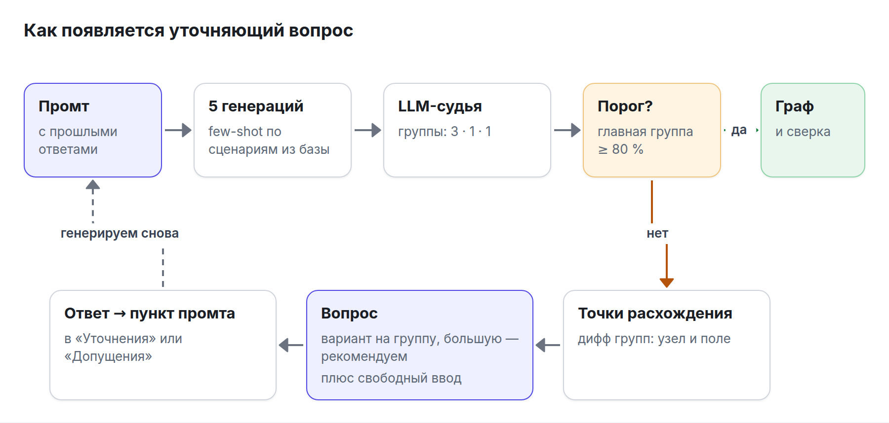

Пример из `ticket-to-prod`. По фразе «спроси у владельца тикета, выкатываем ли» пять генераций делятся на группы 3 · 1 · 1: без срока, 2 дня с напоминанием, 2 дня и отказ. Порог 80 % не пройден. Поэтому Женя видит вопрос «Сколько ждать ответа владельца тикета?» с тремя вариантами, первый помечен «рекомендуем».

### Сверка и описатель

- **Сверка** — тот же механизм против текущего OWS:
  - согласованность — доля генераций, эквивалентных OWS;
  - покрытие узлов и пунктов — по связям «пункт ↔ узлы», которые ведёт описатель.
- **Описатель:**
  - вход: старый промт, старый и новый OWS, их дифф;
  - выход: минимальная правка промта — только затронутые пункты — и обновлённые связи пунктов с узлами.
- **Проверка описателя:**
  - новый промт порождает новый граф — это и есть сверка;
  - старый промт новый граф не порождает — иначе правка в промт не попала.
- **Когда работает описатель.** На каждой правке через API. Результат сразу попадает в черновик и виден во вкладке «Промт» экрана изменений; автор правки может поправить слова.

Показатели сверки:

| Показатель | Что значит | Порог (предложение) |
| --- | --- | --- |
| Согласованность | Сколько из N генераций по промту LLM-судья признал эквивалентными текущему OWS, включая jq-выражения | ≥ 4 из 5 |
| Покрытие узлов | Доля узлов OWS, за которыми стоит пункт промта | 100 % или допущение |
| Покрытие пунктов | Доля пунктов промта, у которых есть узлы | 100 % |

Итог — один из трёх статусов:

- **«Согласовано».** Пользователю ничего не показываем.
- **«Нужно уточнить»** — генерации расходятся между собой. Пользователь получает уточняющий вопрос.
- **«Расходится»** — генерации согласны друг с другом, но не с OWS. Описатель правит промт ещё раз. Если не вышло, во вкладке «Промт» экрана изменений появляется мягкая подсказка «проверьте формулировку пункта N».

Сверка не закрывает публикацию и не показывает цифр. Гейт публикации для пользователя — диагностика OWS, подключённые шаги, проверка поведения и ревью. Проверка поведения — отдельный прогон по ситуациям из промта (см. ниже), со сверкой она не связана.

Пример. Гоша добавляет в OWS три повтора проверки здоровья при сбое связи. В промте об этом ничего нет, покрытие узлов падает. Описатель добавляет пункт «если сервис не отвечает, повтори проверку до 3 раз с растущей паузой», и сверка снова даёт 5 из 5. Гоша видит только новый пункт во вкладке «Промт» экрана изменений.

### Проверка поведения

Пользователь её не запускает, отдельного экрана песочницы в интерфейсе нет. Проверка ищет места, где процесс ведёт себя не так, как сказано в промте.

1. **Ситуации.** По пунктам промта генератор строит ситуации: владелец одобрил, отказал, молчит дольше срока; шаг не отвечает; событие не пришло. У каждой — ожидаемый исход словами из промта.
2. **Прогон.** Каждая ситуация прогоняется на песочнице движка: ответы шагов подставляются, часы перематываются, настоящие вызовы не делаются. Операции уже есть: `startFabula`, `completeSandboxInvocation`, `publishSandboxEvent`, `advanceSandboxClock`.
3. **Сравнение.** Исход прогона — путь по графу и выход — сравнивается с ожидаемым. Расхождение становится находкой: ситуация, что произойдёт и шаги, где это случается.
4. **Показ.** Находки — в карточке «Проверка поведения» на экране изменений и подсветкой на графе. Итог — пункт гейта публикации; просмотренная находка публикацию не блокирует.

Пример. После правки Жени ситуация «владелец молчит 4 дня» заканчивается в ветке «нет» без комментария, а промт об этом молчит. Находка подсвечивает шаги «Напомнить в тикете» и «Одобрено?».

### Стоимость

- **Кэш по дайджестам** промта, реестра шагов и OWS: одинаковый вход не генерируется повторно.
- **Сверка при сохранении с debounce.** Быстрый путь без судьи отсекает большинство пар.
- **Бюджет на сценарий и N** — настройки сервиса, в интерфейсе их нет.

### Шаги и мосты к исполнителям

В OWS каждое шаг-действие — вызов `call: 'name:version@provider'`. Движок разрешает ссылку через порт `CapabilityCatalog` и вызывает шаг через порт `CapabilityInvoker`. Типы шагов в палитре — это исполнители за этими портами:

| Шаг в UI | Где исполняется | Как подключается |
| --- | --- | --- |
| Агент | Агенты gena, например `agent.run:1@gena` | Агент — capability со схемой задачи и результата |
| Человек | Вопрос в трекере, например `human.approve:1@gena` | Ответ человека приходит результатом вызова |
| MCP-инструмент | Мост MCP | Инструмент подключённого сервера становится capability; его JSON Schema — схема входа и выхода |
| HTTP-запрос | Мост HTTP | Эндпоинт по описанию OpenAPI или по схеме, заданной вручную |
| Операция Нирваны | Мост к Нирване, внутреннему исполнителю графов | Запуск операции, ожидание завершения и отмена; если исполнитель не умеет push-доставку — через `PollingCapabilityInvoker` |

- **Реестр шагов — внутренний.** Из него берут палитра редактора, генератор (контекст для few-shot) и проверки эффектов и отменяемости. Раздела «Каталог» в интерфейсе нет.
- **Версии закрепляются.** При публикации дескрипторы шагов попадают в снимок сценария. Новая версия MCP-инструмента или агента не меняет идущие запуски.
- **Мост держит контракт порта.** Вызов идемпотентен по `invocation_id`, результат приходит хотя бы один раз, отмена — best effort.

### Новое API

| Ресурс | Что умеет | Для чего |
| --- | --- | --- |
| Промт в версии | Промт в `publishVersion` и `getVersion`, дифф промта в `diffVersions` | Промт — часть версии |
| Черновики | Создать, читать, дифф с началом правки, сохранить с `expected_revision` | Правки через API до публикации, экран «Посмотреть изменения» |
| Генерации | Запустить, получить группы и вопросы, ответить | Создание сценария: граф рядом с промтом, вопросы под промтом |
| Сверка | Запустить прогон, получить показатели и расхождения | Внутренний прогон после правки; в UI — вопрос или подсказка на экране изменений |
| Описатель | Предложить правку промта по диффу OWS | Автообновление промта в черновике |
| Проверка поведения | Сгенерировать ситуации по промту, прогнать на песочнице, вернуть находки с шагами | Карточка «Проверка поведения» на экране изменений, пункт гейта |
| Входящие | Список по актору, отметка «сделано» | Раздел «Входящие» |
| Задачи шагов «человек» | Ждущие вызовы шагов-людей по адресату и названию шага; ответ закрывает вызов | Входящие: «Ждут меня» и фильтры по шагам |
| Сохранённые виды | Создать, изменить, удалить | Раздел «Запуски» |
| Объяснение | `explain` для запуска со ссылкой на пункт промта | Карточка запуска |
| Метрики плеч | Агрегаты по тегу и плечу A/B | Шаг «Выкатка», страховка эксперимента |
| Эксперимент | Доля новых стартов тега на новую версию с лимитом 50 % и автопаузой по страховке; поверх деления тега | Кнопка «Запустить эксперимент» на шаге «Публикация» |
| Массовые вмешательства | По фильтру, с ходом и отменой | Раздел «Запуски» |
| Шаги и мосты | Подключить MCP-сервер, HTTP-эндпоинт или мост к исполнителю; список шагов для палитры | Палитра и инспектор редактора |
| Просьбы | Правка промта по просьбе с @шагом: план и новый текст | Режим «Промт» редактора |

### Где живёт

- **Пакет.** Новый `ai/gena/services/fabula/studio`: генерация, судья, вопросы, описатель, сверка, просьбы.
- **Мосты** к MCP, HTTP и Нирване — адаптеры порта `CapabilityInvoker`, по адаптеру на мост. Реестр шагов для палитры и генератора — за портом `CapabilityCatalog`.
- **LLM** закрыт портом, как `ConflictResolutionAgent` в менеджере.
- **Промты и прогоны** хранятся за портами, в базе рядом со спекой OWS.
- **Сервер** получает новые операции так же, как песочницу: своей таблицей операций для `Dispatcher`.
- **Корпус для оценки генератора** — опубликованные пары «промт + OWS». Смена модели проверяется на них до выкатки.
